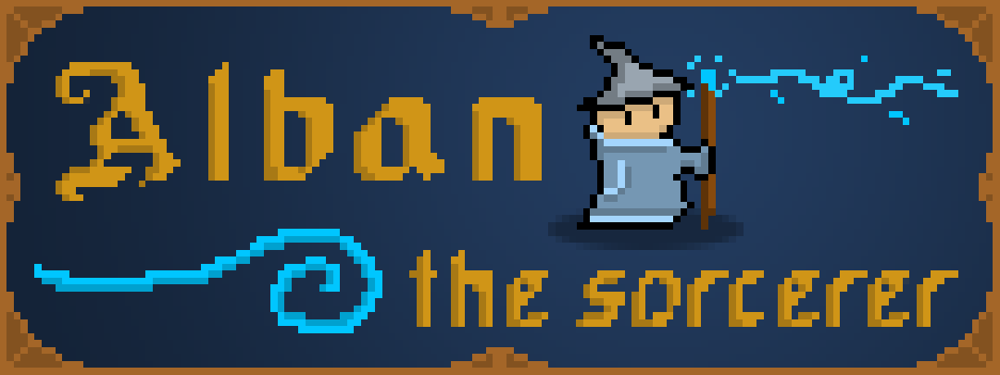

A terminal-based dungeon crawler in C/C++ by [Ashton Nelson](https://github.com/ASTRELION).

### Assignment README Info
#### Assignment 1.01 : Dungeon Generation
A 80x21 dungeon is generated with random rooms that are fully connected by paths. The rooms are a min size of 3x2, intersection of rooms is implemented so that rooms never intersect and have a minimum of 1 unit of space between them.

#### Assignment 1.02
*Completed by Wednesday, September 12th, 2018*

#### Assignment 1.03
*Completed by Wednesday, September 19th, 2018*

#### Assignment 1.04
*Completed by Wednesday, September 26th, 2018*

#### Assignment 1.05
*Completed by Wednesday, October 3rd, 2018*

#### Assignment 1.06
*Completed by Wednesday, October 10th, 2018*

#### Assignment 1.07
*Completed by Wednesday, October 17th, 2018*

#### Assignment 1.08
*Completed by Wednesday, October 24th, 2018*

#### Assignment 1.09
*Completed by Wednesday, October 31st, 2018*

# Features
- Poorly drawn pixel art
- Bland game mechanics
- Cutting-edge terminal graphics

# How to run
Run `make` in `/AlbanTheSorcerer` to compile project  
Run `./main` to run game

# Links
Github: https://github.com/ASTRELION/AlbanTheSorcerer
